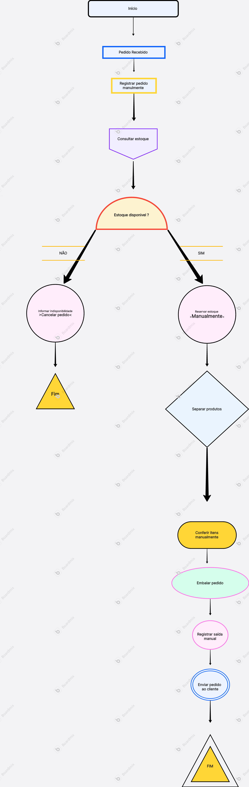
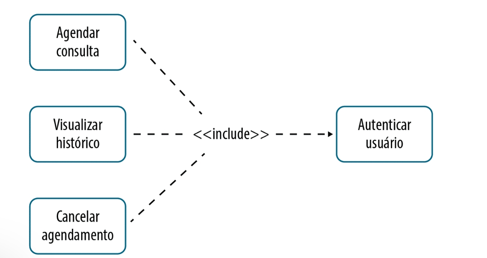
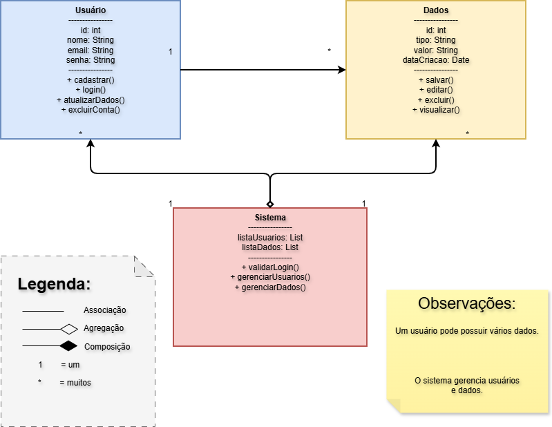

# SGPD — Sistema de Gestão de Processos Digitais

Projeto de modelagem de sistema desenvolvido na disciplina de Design
UX/UI (1º semestre, Ciência da Computação), cobrindo modelagem de
processo de negócio (BPMN), casos de uso (UML) e estrutura de dados
(diagrama de classes).

## Sobre o projeto

O SGPD é um sistema para gerenciar o ciclo de vida de processos
digitais — cadastro, consulta, aprovação, atualização de status e
histórico de ações. O projeto cobre três camadas de modelagem que juntas
formam a documentação técnica de um sistema antes da implementação:
processo de negócio, comportamento do usuário (casos de uso) e estrutura
de dados (classes).

## 1. Modelagem do processo de negócio (BPMN)

O fluxo principal do SGPD cobre o ciclo de vida de um processo digital:
cadastro, consulta, análise, aprovação (ou correção) e atualização de
status, com registro de histórico em cada etapa.

**Funcionalidades centrais mapeadas:**
- Cadastrar Processo — permite cadastrar novos processos
- Consultar e Visualizar Processo — permite listar e visualizar processos
- Controle de Status — permite acompanhar status dos processos
- Atribuição de Responsáveis — permite vincular usuários aos processos
- Registro de Histórico — permite registrar ações nos processos

O fluxo inclui um ponto de decisão central ("Aprovado?") que direciona o
processo para atualização de status (caminho positivo) ou correção
(caminho negativo, retornando ao fluxo de análise).

## 2. Casos de uso (UML)

Os casos de uso mapeiam as interações possíveis entre o usuário e o
sistema, incluindo relações de dependência entre funcionalidades.

### Relação «include» — dependência obrigatória

Três casos de uso (Agendar consulta, Visualizar histórico, Cancelar
agendamento) dependem obrigatoriamente da autenticação do usuário para
serem executados.

### Relação «extend» — comportamento opcional

O caso de uso "Agendar consulta" pode opcionalmente estender para
"Cadastrar interesse" — um comportamento adicional que só ocorre em
condições específicas (por exemplo, quando não há horário disponível).

**Por que essa distinção importa:** `<<include>>` representa uma
dependência sempre executada (não existe "Agendar consulta" sem
"Autenticar usuário" antes). `<<extend>>` representa um comportamento
condicional, que só é acionado em cenários específicos. Modelar essa
diferença corretamente evita ambiguidade na implementação.

## 3. Diagrama de classes

A estrutura de dados do sistema é modelada em três classes principais,
com suas relações de associação e agregação.

**Classes modeladas:**
- **Usuário** — id, nome, email, senha, com métodos de cadastro, login,
  atualização de dados e exclusão de conta
- **Dados** — id, tipo, valor, data de criação, com métodos de salvar,
  editar, excluir e visualizar
- **Sistema** — classe central que agrega listas de usuários e dados,
  responsável por validar login e gerenciar usuários e dados

A relação entre Sistema e as demais classes é de agregação (um Sistema
agrega Usuários e Dados, mas essas entidades podem existir de forma
relativamente independente), enquanto a relação entre Usuário e Dados é
de associação simples (um usuário pode possuir vários dados).

## O que esse projeto demonstra

- Capacidade de modelar um sistema em múltiplas camadas antes de
  escrever código (processo, comportamento, dados)
- Compreensão de notações técnicas padrão da indústria (BPMN, UML)
- Distinção correta entre dependências obrigatórias e opcionais em
  casos de uso
- Pensamento estruturado sobre relacionamentos entre entidades de dados

---

[← Voltar para a pasta principal](../README.md)