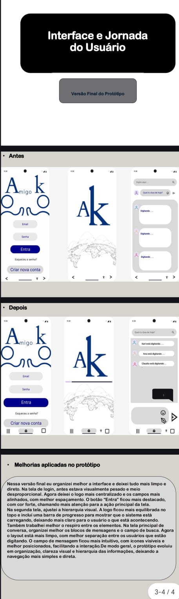
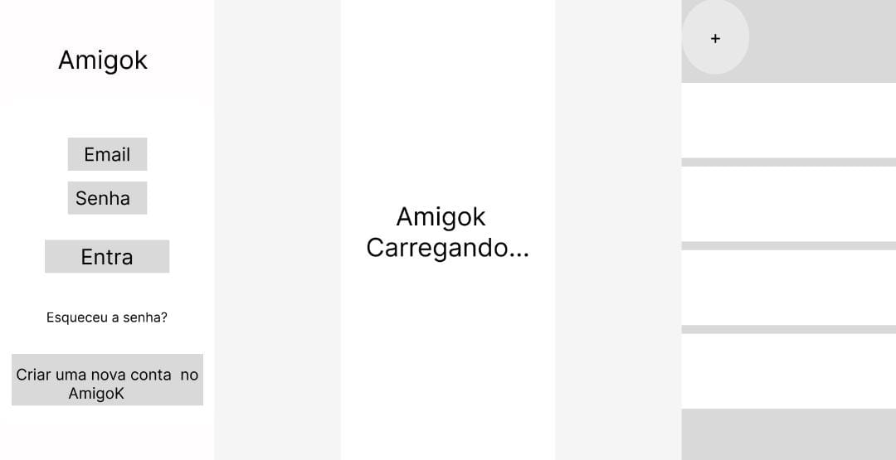
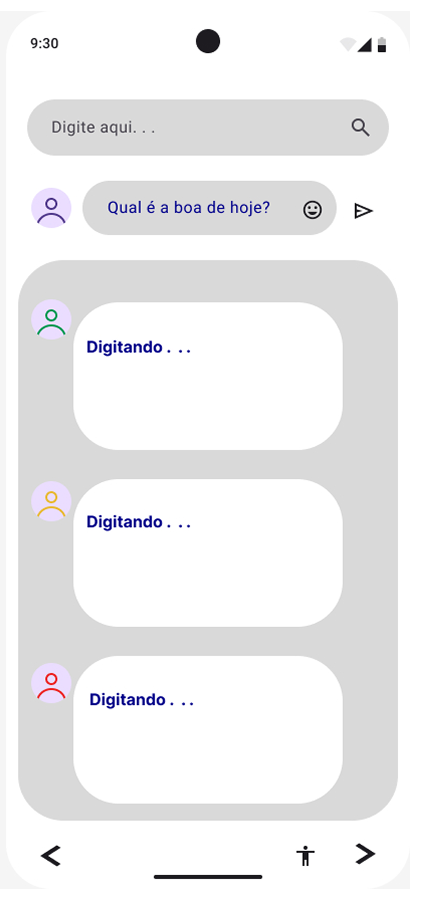
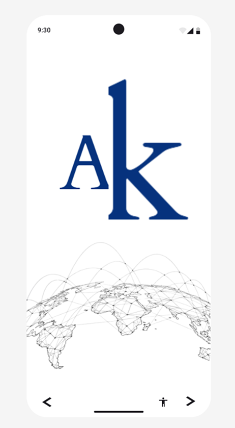
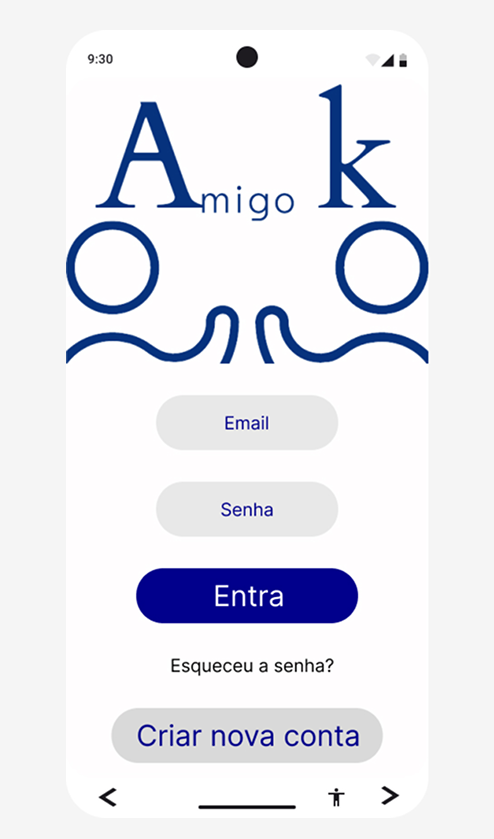
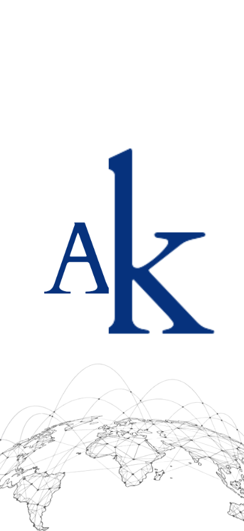
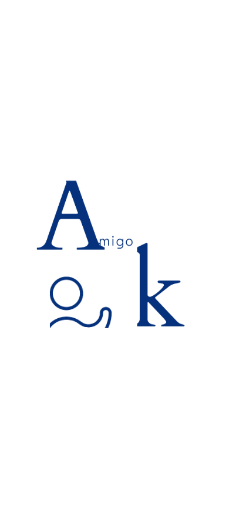
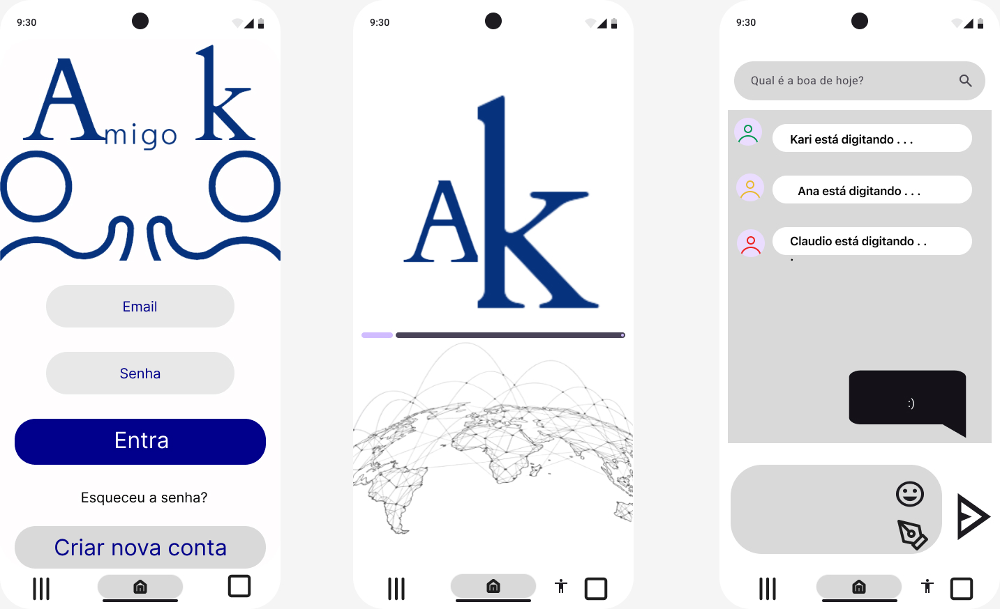
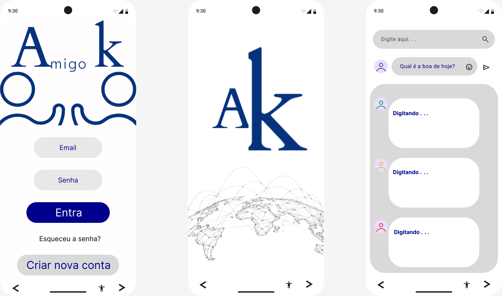

# AmigoK — Protótipo de App de Chat Social

Projeto de prototipagem de UX/UI desenvolvido na disciplina de
Prototipagem de Sistemas (1º semestre, Ciência da Computação).

🔗 [Ver protótipo completo no Figma](https://www.figma.com/design/b7NSXyOdLBov76ePEk816f?node-id=0-1)

---

## Sobre o projeto

AmigoK é o conceito de um aplicativo de chat e conexão social, prototipado
do zero — da identidade visual ao fluxo de navegação entre telas.

O objetivo do exercício foi praticar o processo real de design de produto:
entender o problema, mapear a persona, estruturar o esqueleto da interface
(wireframe), evoluir para um protótipo de média fidelidade, testar o fluxo
de navegação e revisar com base em hierarquia visual e usabilidade.

## Processo de design

### 1. Identidade visual
Definição do logo e paleta de cores do app — combinação tipográfica
"A" e "k" formando a marca AmigoK.

### 2. Wireframe (esqueleto)
Estrutura inicial das telas sem refinamento visual, focando em
hierarquia de elementos e fluxo básico.

### 3. Protótipo de média fidelidade
Três telas centrais do fluxo do usuário:

**Tela de login**

**Tela de carregamento (splash)**

**Tela de chat**

### 4. Fluxo de navegação
Mapeamento das conexões entre as telas, simulando a jornada real do
usuário dentro do app.

### 5. Revisão e melhorias (antes / depois)

Nessa etapa reorganizei a interface e deixei tudo mais limpo e direto.
Na tela de login, antes estava visualmente pesado e mal proporcional —
ajustei o logo, o espaçamento e destaquei melhor o botão principal "Entra".

Na tela de splash, equilibrei a hierarquia visual e incluí uma barra de
progresso para indicar carregamento de forma mais clara.

Na tela de chat, melhorei a separação entre elementos, deixei o campo de
mensagem mais intuitivo e adicionei ícones visíveis para facilitar a
interação.

De modo geral, o protótipo evoluiu em organização, clareza visual e
hierarquia de informação — deixando a navegação mais simples e direta.

### 6. Processo no Figma
Etapas de construção do protótipo, incluindo o mapeamento de persona
no FigJam.

---

## O que esse projeto demonstra

- Processo de design de produto do zero (não só uma tela bonita)
- Capacidade de identificar e corrigir problemas de usabilidade
  (comparação antes/depois documentada)
- Mapeamento de fluxo de navegação e jornada do usuário
- Construção de persona como base para decisões de design
- Uso de ferramentas profissionais de prototipagem (Figma, FigJam)

## Tecnologias e ferramentas

- Figma (design e protótipo interativo)
- FigJam (mapeamento de persona e fluxos)

---

## Contexto

Este projeto foi desenvolvido como parte da minha formação em Ciência da
Computação, durante minha transição de carreira de operações logísticas
(10+ anos em DHL, Amazon, Mercado Livre) para tecnologia. A prática de UX/UI
complementa minha visão de produto, já que venho de uma área onde a
experiência do usuário final (operador, cliente) sempre foi parte da
minha rotina profissional.

[← Voltar para a jornada completa](../../README.md)